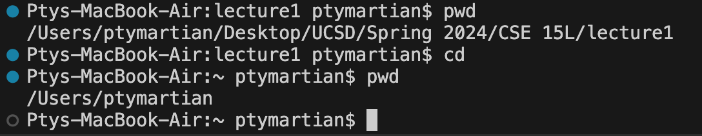
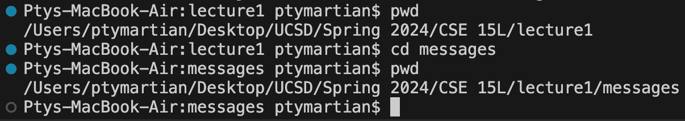
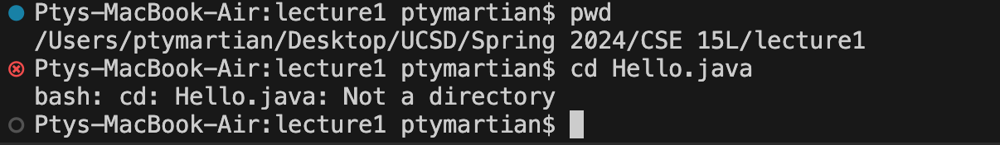
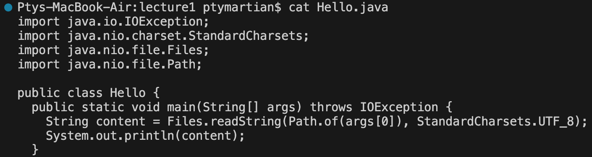

# Lab Report 1
---
## `cd` Command:
1. no arguments

The absolute path when the program was run was `/Users/ptymartian/Desktop/UCSD/Spring 2024/CSE 15L/lecture1`. There is nothing output when the command has no arguments, which means the directory was changed successfully and no errors occurred. When not given a target directory, it seems that /Users/ptymartian is the directory that is defaulted. I assume the reason for having such a system is to quickly and reliably have a way to reset when in a very nested directory.

2. path to directory

Again the absolute path was `/Users/ptymartian/Desktop/UCSD/Spring 2024/CSE 15L/lecture1`. There was no output message which means the directory was changed successfully and no errors were encountered. Because the `cd` command is intended for exactly receiving directories as arguments, so it is natural that the command works as intended. The command changes the working directory from the one in the absolute path above to the absolute path concatenated with the directory given as the argument.

3. path to file

The absolute path was `/Users/ptymartian/Desktop/UCSD/Spring 2024/CSE 15L/lecture1`. The output message indicates that `Hello.Java` is not a directory, which is to be expected because it is indeed a file and not a directory, and therefore causes an error. The working directory then remains the same as before the command was issued, and therefore the filepath remains the same.

## `ls` Command:
1. no arguments

The absolute path was `/Users/ptymartian/Desktop/UCSD/Spring 2024/CSE 15L/lecture1`. The output is a printed list of the names of the contents of the folder `lecture1` as they appear in the folder. Because no argument is given, the default directory to list items out of is the current working directory when the command is issued. The fact that the contents of `lecture1` are successfully printed means that no errors were present.

2. path to directory

The absolute path was `/Users/ptymartian/Desktop/UCSD/Spring 2024/CSE 15L/lecture1`. The output is again a printed list of names of contents of a folder, however this time it is the contents of the folder `messages`, the directory given as the argument. Again the fact that the contents are printed indicates that the command ran correctly with no errors. An important thing to note is that the working directory was not changed after the contents of `messages` were listed. 

3. path to file

The absolute path was `/Users/ptymartian/Desktop/UCSD/Spring 2024/CSE 15L/lecture1`. The output is simply the name of the file passed as the argument to the command. This output is not an error because the only file in the given path would be `Hello.java`, as this is not a directory and therefore cannot contain any other files. Again the filepath is not changed after the command is run.

## `cat` Command:
1. no arguments

The absolute path was `/Users/ptymartian/Desktop/UCSD/Spring 2024/CSE 15L/lecture1`. Without an argument, it seems that the command does not terminate until something else is performed. I do not believe this is an error, rather just an awaiting of input. I'm not exactly sure what input it would be expecting but my guess would be files that would be used as if they were passed as arguments.

2. path to directory

The absolute path was `/Users/ptymartian/Desktop/UCSD/Spring 2024/CSE 15L/lecture1`. With a directory passed as an argument, the output gives an error saying that the argument `messages` was in fact a directory instead of a file. This behavior makes sense because `cat` is meant to print the contents of a file, and if it were to do the same with directories, it would simply fill the roll of the command `ls` as well.

3. path to file

The absolute path was `/Users/ptymartian/Desktop/UCSD/Spring 2024/CSE 15L/lecture1`. The output is the exact contents of the file, formatted similarly. This output is not an error, as this is exactly what the command is intended to do. Because the full name of the command is "concatenate", I assume the command can be used to somehow print the joining of contents of multiple files in some way.
