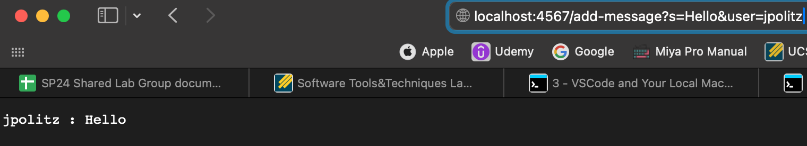
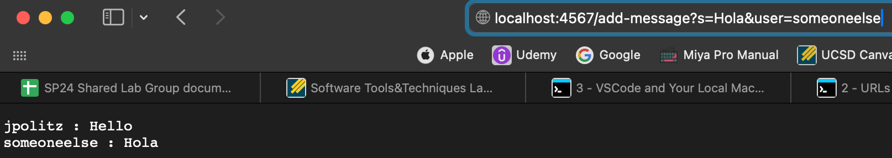

```
import java.io.IOException;
import java.net.URI;

class ChatHandler implements URLHandler {
    String s = "";

    public String handleRequest(URI url) {
        if (url.getPath().equals("/")) {
            return s;
        } else if (url.getPath().contains("/add-message")) {
            String[] parameters = url.getQuery().split("=");
            String[] splitParams = parameters[1].split("&");
            s = s + String.format("%s : %s", parameters[2], splitParams[0]) + '\n';
            return s;
        } else { return "404 Not Found!"; }
        }
    }

    class ChatServer {
        public static void main(String[] args) throws IOException {
            if(args.length == 0){
                System.out.println("Missing port number! Try any number between 1024 to 49151");
                return;
            }
    
            int port = Integer.parseInt(args[0]);
    
            Server.start(port, new ChatHandler());
        }
    }
```


The first method called by this is the ```handleRequest``` method in the ```ChatHandler``` class. 





