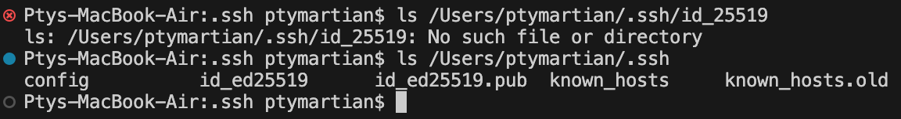
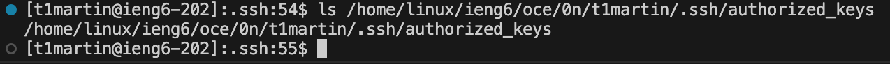
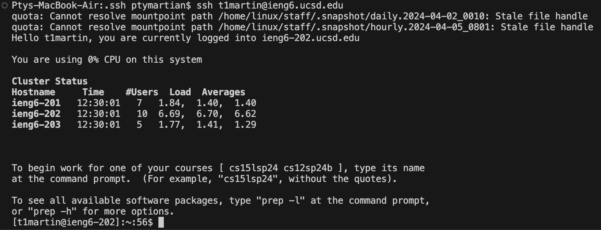

# Lab Report 2

## Part 1

```
import java.io.IOException;
import java.net.URI;

class ChatHandler implements URLHandler {
    String s = "";

    public String handleRequest(URI url) {
        if (url.getPath().equals("/")) {
            return s;
        } else if (url.getPath().contains("/add-message")) {
            String[] parameters = url.getQuery().split("=");
            String[] splitParams = parameters[1].split("&");
            s = s + String.format("%s : %s", parameters[2], splitParams[0]) + '\n';
            return s;
        } else { return "404 Not Found!"; }
        }
    }

    class ChatServer {
        public static void main(String[] args) throws IOException {
            if(args.length == 0){
                System.out.println("Missing port number! Try any number between 1024 to 49151");
                return;
            }
    
            int port = Integer.parseInt(args[0]);
    
            Server.start(port, new ChatHandler());
        }
    }
```

**First add message**

The first method called by this is ```handleRequest()``` in the ```ChatHandler``` class. This then calls ```url.getPath().contains()```, ```url.getQuery().split()``` and ```parameters[1].split()```. Finally the string is added and the output is formatted with ```String.format()```. The relevant argument for ```handleRequest()``` is the url ```http://localhost:4567/add-message?s=Hello&user=jpolitz```. The relevant argument for ```url.getPath().contains()``` is ```"/add-message"```. The relevant arguments for ```url.getQuery().split()``` and ```parameters[1].split()``` are ```"="``` and ```"&"``` respectively. For ```String.format()```, ```parameters[2]``` and ```splitParams[0]``` are the outputs that get formatted and concatenated to the class field ```s```, which is the string which holds all the text. The concatenation adds the given parameters of the url, in this case "jpolitz" and "Hello" separated by a colon, along with the newline character to the empty string ```s```.

**Second add message**

The methods called for this url are very similar to the previous. The first method called is ```handleRequest()``` in the ```ChatHandler``` class. Then ```url.getPath().contains()```, ```url.getQuery().split()``` and ```parameters[1].split()```. The string is added and the output is formatted with ```String.format()```. The relevant argument for ```handleRequest()``` is the url ```http://localhost:4567/add-message?s=Hola&user=someoneelse```. The relevant argument for ```url.getPath().contains()``` is ```"/add-message"```. The relevant arguments for ```url.getQuery().split()``` and ```parameters[1].split()``` are ```"="``` and ```"&"``` respectively. For ```String.format()```, ```parameters[2]``` and ```splitParams[0]``` are the outputs that get formatted and concatenated to the class field ```s```. The concatenation adds "someoneelse" and "Hola", again with a colon in between along with the newline character at the end, to the string ```s```, which now contains "jpolitz : Hello \n".

---

## Part 2

**Absolute path to private key**


**Absolute path to public key on ieng6**


**Local login to ieng6 without password**


---

## Part 3
Lab 2 taught me how simple reading and handling URLs can be and how easy simple websites can be made. I also learned that websites can be accessed and viewed through terminal commands fairly easily.
