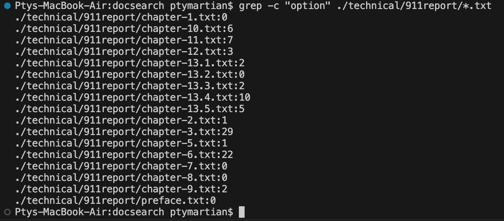
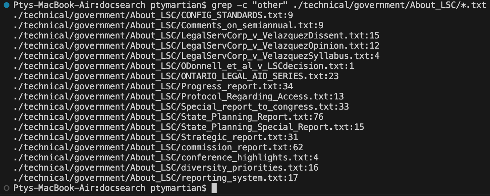
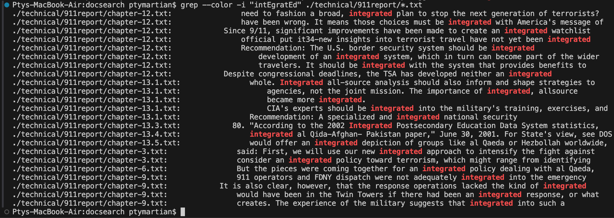
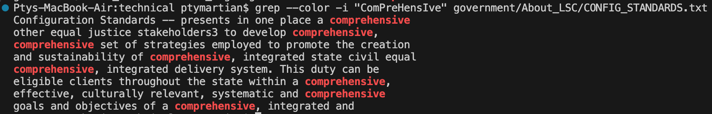
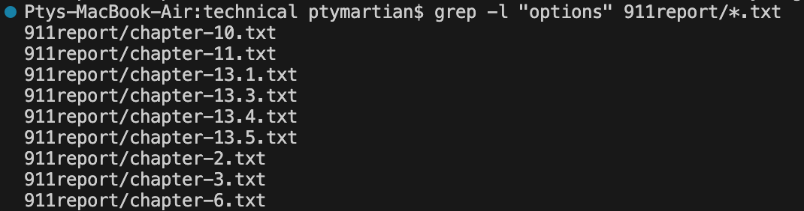
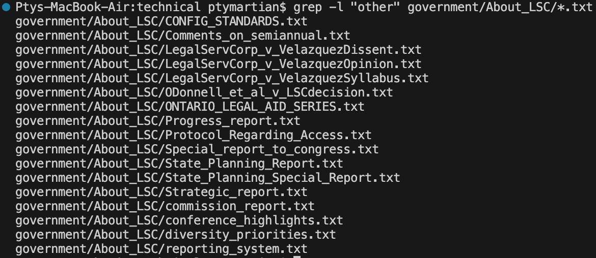
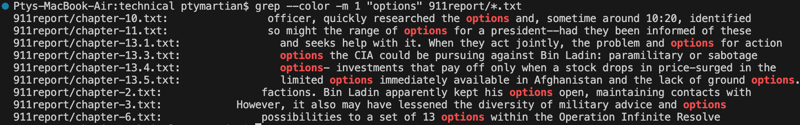
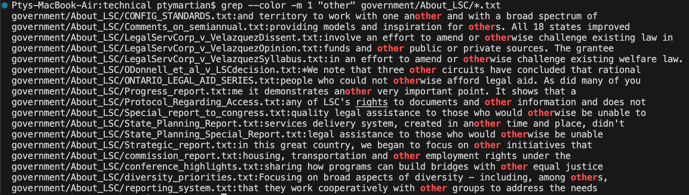

# Lab Report 3 - Bugs and Commands
---
## Part 1 - Bugs
I chose the method reverseInPlace in the ArrayExamples class: 
```
static void reverseInPlace(int[] arr) {
  for(int i = 0; i < arr.length; i += 1) {
    arr[i] = arr[arr.length - i - 1];
  }
}
```

A failure inducing input on this method:
```
@Test
public void testReverseInPlaceFull() {
  int[] input1 = {1, 2, 3};
  ArrayExamples.reverseInPlace(input1);
  int[] expected = {3, 2, 1};

  assertArrayEquals(expected, input1);
}
```

An input that does not induce failure:
```
@Test 
public void testReverseInPlace() {
  int[] input1 = { 3 };
  ArrayExamples.reverseInPlace(input1);
  assertArrayEquals(new int[]{ 3 }, input1);
}
```

Output of running the two tests above:


The code before and after being fixed:
```
static void reverseInPlace(int[] arr) {
  for(int i = 0; i < arr.length; i += 1) {
    arr[i] = arr[arr.length - i - 1];
  }
}
```
```
static void reverseInPlace(int[] arr) {
  int[] temp = new int[arr.length];
  for(int i = 0; i < arr.length; i += 1) {
    temp[i] = arr[arr.length - i - 1];
  }
  for(int i = 0; i < arr.length; i += 1) {
    arr[i] = temp[i];
  }
}
```

The issue with the original method was trying to reverse the array without storing the values of the original array. This means that when a value is written over, the original can no longer be placed in its correct place. The fixed code creates an empty array of the same size, and then reverses the values by copying in reverse order to the new array, which allows for all the original values to be kept.

---
## Part 2 - Researching commands
Command: `grep`

### Option 1: `-c`

Returns the count of how many times the pattern "option" appears in each `.txt` file in `technical/911report` next to the relative path of the file.



Returns the count of how many times the pattern "other" appears in each `.txt` file in `technical/government/About_LSC` next to the relative path of the file.


### Option 2: `-i`


Returns the lines of text containing the case-insensitive pattern "integrated" in each `.txt` file in `technical/911report` next to the relative path of the file.


Returns the lines of text containing the case-insensitive pattern "comprehensive" in `government/About_LSC/CONFIG_STANDARDS.txt`.

### Option 3: `-l`


Returns the relative paths of the `.txt` files containing the pattern "options" at least one time in `technical/911report`


Returns the relative paths of the `.txt` files containing the pattern "other" at least one time in `technical/government/About_LSC`

### Option 4: `-m`


Returns the lines of the first n matches of the pattern "options" in all the `.txt` files in `technical/911report` next to the file's relative path. In this case, n is specified to be 1.


Returns the lines of the first n matches of the pattern "other" in all the `.txt` files in `government/About_LSC` next to the file's relative path. In this case, n is specified to be 1.

All options were found using the integrated `man` command
