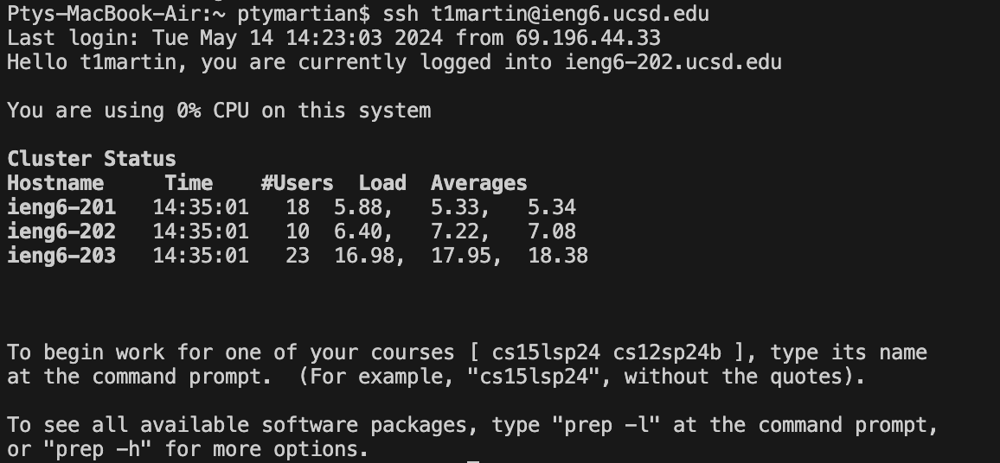
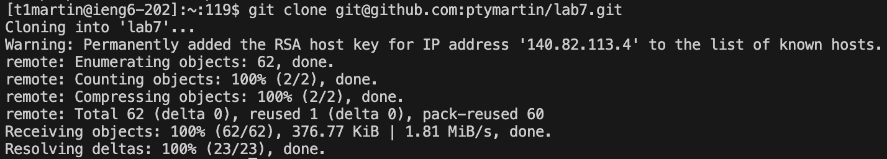
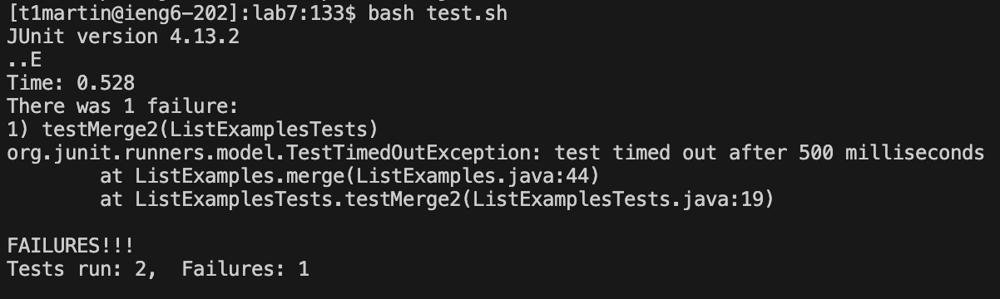
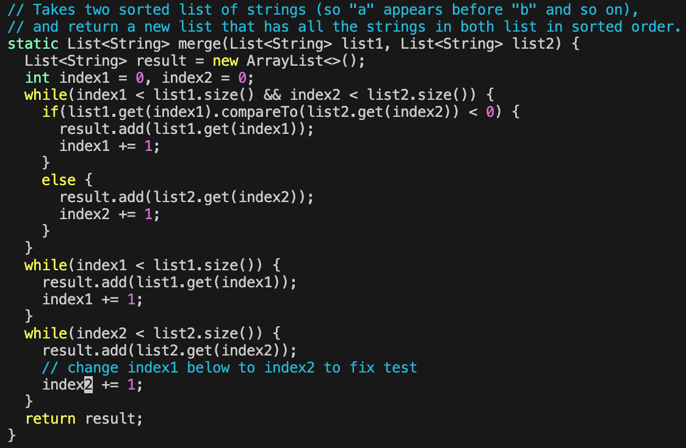
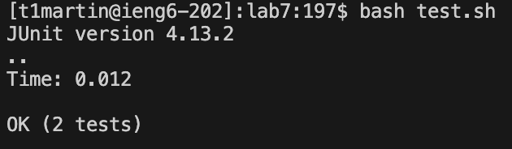
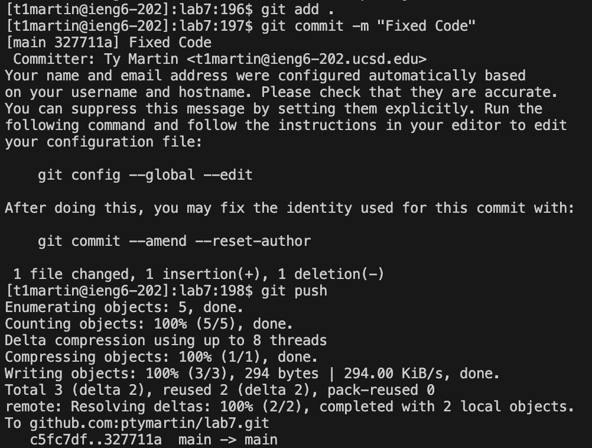

# Lab Report 4
---

## Step 4:

**Input:** `ssh<space>t1martin@ieng6.ucsd.edu<enter>`

**Image:** 

**Explanation:** basic login to ieng6 server with linux ssh command.

## Step 5:

**Input:** `git<space>clone<space><command>+v<enter>`

**Image:** 

**Explanation:** cloning the repository in ieng6 server with ssh link to repository copied.

## Step 6:

**Input:** `cd<space>lab7<enter>bash<space>test.sh<enter>`

**Image:** 

**Explanation:** `cd lab7` changes active directory to the lab7 directory in the cloned repository. `bash test.sh` runs the test bash script, which returns errors.

## Step 7:

**Input:** `vim<space>ListExamples.java<enter>:44<enter>exi2<esc>:wq<enter>`

**Image:** 

**Explanation:** `vim ListExamples.java` opens the ListExamples java file in the vim editor. `:44` moves the cursor to the 44th line of code in the file and `e` moves the cursor to the end of the first word. `x` deletes the character under the cursor, which in this case is the number 1. `i` enters insert mode and `2` places a 2 under the cursor. `:wq` saves the changes to the file and exits the vim edit.

## Step 8:

**Input:** `<up><up><enter>`

**Image:** 

**Explanation:** `bash test.sh` command was 2 up in the history, so I used the arrowkeys to select it and ran it.

## Step 9:

**Input:** `git<space>add<space>.<enter>git<space>commit<space>-m<space>"Fixed<space>Code"<enter>git<space>push<enter>`

**Image:** 

**Explanation:** `git add .` adds the changes to the current directory to the staging area, `git commit` creates a snapshot of the changes and the `-m` option allows for the commit message to be typed in, which was "Fixed Code". `git push` sends the changes to the repository along with the message.
